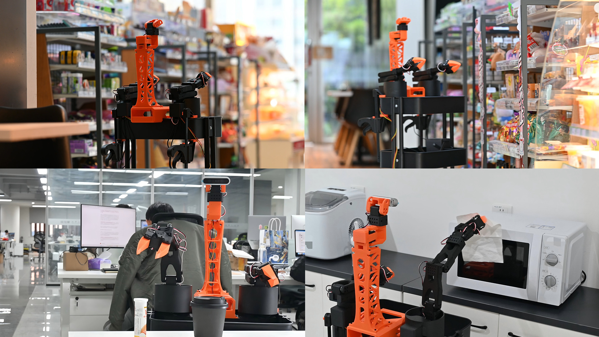

# XLerobot-X1

## Project Overview

XLerobot-X1 is a low-cost dual-arm mobile robot platform based on Qualcomm QCS8550 edge computing device, designed for embodied intelligence research. Through systematic design and open-source community collaboration, this platform achieves practical dual-arm manipulation capabilities at a cost of nearly 5,000 RMB, unlocking new possibilities for embodied intelligence research.





## Core Design Philosophy

1. **Modular and Scalable Design**
   - Standardized Interfaces: Defined mechanical and electrical interfaces enable independent development and upgrade of the mobile platform and manipulation arms
   - Hardware-Software Decoupling: The control system employs a layered architecture, separating upper-level task planning from lower-level motion control
   - Progressive Capability Expansion: Allowing researchers to add sensors, actuators and other components incrementally based on specific needs

2. **Cost Optimization and Performance Balance**
   - Optimized Material Selection: 90% of the components are 3D-printed, combined with cost-effective motors and electronic parts
   - Workspace Optimization: The effective working range of the SO101 robotic arm (approximately 40 cm) is maximized through mechanical structural design
   - Optimized Control Strategy: A Bluetooth control solution is adopted to avoid the high costs of WiFi/5G communication

3. **Safety and Reliability Design**
   - Physical Safety Design: Physical constraints including low-torque motors, short arm length, and a wheeled base ensure the system poses minimal physical risk to humans
   - Control Safety Mechanisms: Software-imposed limits on motion range, speed and force prevent accidental operations
   - Fail-Safe Design: Redundant design is applied to key systems to ensure a single fault will not result in complete system failure

## Core Technical Analysis

1. **Mechanical Structure and Kinematic Design**
   - Equipped with dual SO-101 robotic arms, each with 6 degrees of freedom and a single-arm load capacity of 600–1000 g
   - Maximizes working range through optimized arm length and joint configuration, meeting basic operational needs in household scenarios
   - Applies topology optimization technology to 3D-printed parts to reduce weight while ensuring structural strength

2. **Control System Architecture**
   - Lower-Level Motion Control Layer: Real-time control via the Rhino Pi X1 (based on the QCS8550 platform)
   - Middle-Level Task Execution Layer: Implementing task decomposition and motion trajectory generation
   - Upper-Level Decision-Making and Learning Layer: Integrating AI models to support visual perception, task planning and learning

3. **Sensor Fusion and Perception System**
   - Multi-Modal Perception: Fusing data from vision, depth, touch and other sensors to enhance environmental understanding capabilities
   - Lightweight Processing: Implementing efficient perception algorithms on edge computing devices
   - Simulation-to-Real Transfer: Supporting rapid algorithm verification and migration via the Maniskill simulation environment

## Quick Start Guide

1. **Read the `Introduction.md` file** to understand the project style and content. It contains a functional description of the Qualcomm version of XLeRobot
2. **Check the principle introduction in the `Principle` document** for a basic understanding of the underlying principles
3. **Review the `Hardware_List` document** which lists all required hardware components for the project with purchase links
4. **Examine the 3D models in the `3D_Printing_Models` folder** which contains all printable parts for the project
5. **Browse the `Assembly_Steps_and_Structure_Diagram` folder** which includes assembly instructions for the robotic arm, chassis, and top mount
6. **Watch the installation tutorial video** [3D打印机械臂安装完整教程](https://www.bilibili.com/video/BV14UfeB9ErT/?share_source=copy_web&vd_source=a0b758095cb5fcb77af22d495bca8199)
7. **Study the wiring diagrams in the `Wiring_Diagram` folder** to learn how to connect all components
8. **After hardware assembly and wiring are complete**, refer to the `Set_Servo_ID` folder which explains how to set and number IDs for all servos
9. **With all hardware work finished**, proceed to the `Code_Resources` folder for software-level instructions

## Code Resources

XLerobot-X1 code resources are based on the XLeRobot project, providing a unified platform for robotics development, including:

- Robot control and teleoperation
- Computer vision and perception
- Machine learning and reinforcement learning
- Simulation environments
- Data collection and processing
- Motor control and calibration

### Project Structure

```
lerobot/
├── examples/           # Example scripts and demonstrations
├── src/                # Source code
│   └── lerobot/        # Main package
│       ├── async_inference/    # Asynchronous inference for policy execution
│       ├── cameras/            # Camera modules and interfaces
│       ├── configs/            # Configuration management
│       ├── datasets/           # Dataset handling and processing
│       ├── envs/               # Simulation environments
│       ├── motors/             # Motor control and calibration
│       ├── optim/              # Optimization tools for training
│       ├── policies/           # Policy implementations
│       ├── rl/                 # Reinforcement learning utilities
│       ├── robots/             # Robot implementations
│       ├── scripts/            # Command-line scripts
│       ├── teleoperators/      # Teleoperation interfaces
│       ├── transport/          # Communication utilities
│       ├── utils/              # General utility functions
│       ├── __init__.py         # Module initialization
│       └── __version__.py      # Version information
├── .gitignore          # Git ignore file
├── LICENSE             # License file
├── README.md           # README file
├── README_zh.md        # Chinese README file
├── pyproject.toml      # Project configuration
└── requirements.txt    # Dependencies
```

## Application Scenarios

1. **Academic Research Scenarios**
   - Fundamental Research on Embodied AI: Investigating core issues such as physical interaction and environmental adaptation
   - Algorithm Verification: Providing a low-cost environment for verifying new control and learning algorithms
   - Interdisciplinary Research: Promoting cross-disciplinary research in robotics, AI, cognitive science and other fields

2. **Educational Application Scenarios**
   - STEM Education: Providing a practical platform for cutting-edge robotics technology for high school educators
   - Higher Education: Serving as a cost-effective platform for university robotics and AI courses
   - Student Research: Supporting a complete learning path from beginners to advanced researchers

3. **Household Application Scenarios**
   - Daily Housework Assistance: Performing simple household chores such as item delivery and basic organization
   - Home Automation: Acting as a physical interaction interface for smart home systems
   - Security Monitoring: Realizing basic home security monitoring in combination with visual systems

4. **Commercial Application Scenarios**
   - Product Prototype Development: Enabling faster prototype development with the world's most affordable modular robot platform
   - Technology Verification: Verifying the feasibility of new technologies in a low-cost environment
   - Market Exploration: Exploring potential demand and application scenarios in the household robot market

## Getting Started

### Install Joy-Con Driver

```bash
# Clone the repository
git clone https://github.com/box2ai-robotics/joycon-robotics.git
cd joycon-robotics
pip install -e .
sudo apt-get update

sudo apt-get install -y libevdev-dev libudev-dev cmake

# Before running make install, perform the following steps:
# 1. Open Makefile and remove 'install_nintendo' from the second-to-last line, then save
# 2. Create temporary directory
mkdir /tmp/joycon-install-temp
# 3. Execute installation
make install

# Install dependencies
pip install lerobot

# Install servo motor control library
pip install feetech-servo-sdk==1.0.0
```

### Basic Usage

#### Example Code Startup

Example code is provided in the `Code_Resources/XLeRobot-X1/examples/` directory. You can start them as follows:

```bash
# Joy-Con controller test
python 1_test_joycon.py

# XLeRobot 3Wheels teleoperation
python 7_xlerobot_3wheels_teleop_joycon.py

# XLeRobot 3Wheels calibration tool
python 7b_xlerobot_3wheels_calibration.py
```

## Board-Specific Configuration

### Rhino Pi-X1 Configuration

- **System Settings**: Ubuntu 22.04 is recommended for optimal performance
- **Power Management**: Ensure using a power adapter with sufficient power (12V/3A or higher recommended)
- **Heat Dissipation**: Cooling fan or heatsink is recommended for long-term operation
- **Interface Configuration**:
  - Robotic arm control: Use UART interface
  - Camera connection: Use CSI interface
  - Network connection: Use Gigabit Ethernet or Wi-Fi 6

### Performance Optimization

- **AI Inference**: Utilize Qualcomm QCS8550's NPU acceleration
- **Video Processing**: Use Adreno 740 GPU for image processing
- **Multi-threading**: Fully utilize the 6-core CPU architecture

## Contributing

Contributions to XLerobot-X1 are welcome! Please see the contributing guidelines for more information.

## License

XLerobot-X1 is released under the MIT License.
